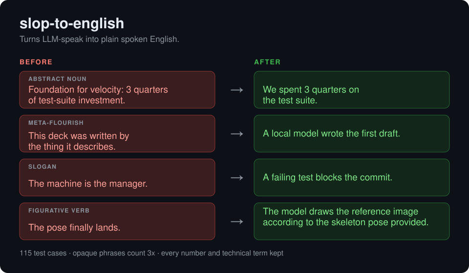

# slop-to-english



Rewrites LLM-speak as plain spoken English. Clone it into your skills folder, then run `/slop-to-english`.

```
git clone https://github.com/andrsnn/slop-to-english ~/.claude/skills/slop-to-english
python evals/run_eval.py --openai-url http://127.0.0.1:8080/v1 --model qwen --skill
```

[Examples](EXAMPLES.md) · [Research](docs/research.md) · [Test cases](evals/cases.jsonl) · Other LLMs: paste [SKILL.md](SKILL.md) as the prompt
